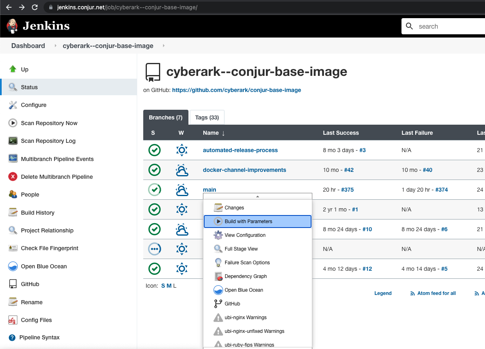
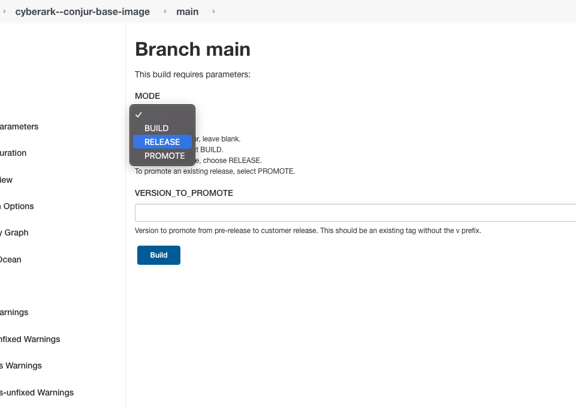

# Contributing to the Conjur base image

Thanks for your interest in the Conjur base image. We welcome contributions!


For general contribution and community guidelines, please see the [community repo](https://github.com/cyberark/community).

## Table of Contents

- [Contributing to the Conjur base image](#contributing-to-the-conjur-base-image)
  - [Table of Contents](#table-of-contents)
  - [Prerequisites](#prerequisites)
  - [Contributing](#contributing)
    - [Contributing workflow](#contributing-workflow)
  - [Development](#development)
  - [Testing](#testing)
    - [Security testing](#security-testing)
  - [Releasing](#releasing)
    - [Pulling Upstream Image Changes](#pulling-upstream-image-changes)


## Prerequisites

Before getting started, you should install some developer tools.

1. [git][get-git] to manage source code
1. [Docker][get-docker] to manage dependencies and runtime environments

[get-docker]: https://docs.docker.com/engine/installation
[get-git]: https://git-scm.com/downloads

## Contributing

### Contributing workflow

1. Search our [open issues](https://github.com/cyberark/conjur-base-image/issues) in GitHub to see what features are planned.

1. Select an existing issue or open a new issue to propose changes or fixes.

1. Add the `implementing` label to the issue that you open or modify.

1. Run [existing tests](#testing) locally and ensure they pass.

1. Create a branch and add your changes. Include appropriate tests and ensure that they pass.

1. Ensure the [changelog](CHANGELOG.md) contains all relevant recent changes with references to GitHub issues or PRs, if possible.

1. Submit a pull request, linking the issue in the description (e.g. Connected to #123).

1. Add the `implemented` label to the issue and request that a CyberArk engineer reviews and merges your code.

From here your pull request is reviewed. Once you have implemented all reviewer feedback, your code is merged into the project. Congratulations, you're a contributor!

## Development

It's easy to get started with Conjur base image

1. [Install dependencies](#Prerequisites)

1. Clone this repository

To build Ubuntu base image:
   ```sh-session
   $ cd dev
   $ ./ubuntu-ruby-fips.sh
   ```

## Testing

Tests are defined in `test.yaml` using [GoogleContainerTools/container-structure-test](https://github.com/GoogleContainerTools/container-structure-test).
To run tests, [build image](#Development) and execute

   ```sh-session
docker run --rm \
  -v /var/run/docker.sock:/var/run/docker.sock \
  -v $(pwd):/workspace \
  gcr.io/gcp-runtimes/container-structure-test:latest \
  test --image "image:tag" --config "/workspace/test.yml" --test-report "/workspace/test-results/report.json"
   ```

Alternatively, you can run the `./{image-name}/test.sh` script after building
the image and view the results in the `./test-results/` folder.

### Security testing
To run vulnerability scanning using [trivy](https://github.com/aquasecurity/trivy) execute

   ```sh-session
 docker run --rm \
   -v /var/run/docker.sock:/var/run/docker.sock \
   -v ${pwd}:/workspace \
   aquasec/trivy:latest \
   --no-progress --ignorefile /workspace/.trivyignore --ignore-unfixed "image:tag"
   ```

## Releasing

Our base images use our automated release process to propagate out everywhere
they're used. To make a new release:

1. Create a new branch for your changes.
2. When the build passes with your changes in the branch, make the PR, get it approved, and merge it.
3. Merging to main will automatically trigger a release build.
4. The release build will automatically trigger downstream builds to update them. Look at the very
   end of the Jenkins log for links to those builds if you want to see what was triggered.
5. That's it. There is no more, even though this feels too easy.

### Pulling Upstream Image Changes

On occasion, our security scans will fail due to security issues detected in upstream images.
When this happens, a new release needs to be created to pull upstream changes
(and rebuild our images based on the new upstream base image(s)).

To trigger a new release with upstream changes:

1. From the [Jenkins Conjur Base Image](https://jenkins.conjur.net/job/cyberark--conjur-base-image/) page,
create a build with parameters.

   
2. Select "Release" from the "Mode" dropdown and click the "Build" button:

   
